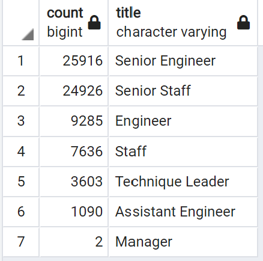
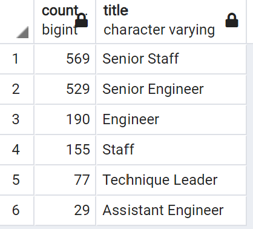

# Pewlett-Hackard-Analysis

Module 7

Laurina LaStella

2022 July

# Overview of the Analysis

## Determine the number of retiring employees per title, and identify employees who are eligible to participate in a mentorship program.

### The employees for both of these categories are filtered by their birthdates.

-------

# Results

1. Positions "Senior Engineer" and "Senior Staff" have the highest number of upcoming retirements.

2. "Engineer," "Staff," and "Technique Leader" are the next highest numbers among retiring staff.

3. Positions have more spread and variability among the mentor category.

3. "Senior Staff" and "Senior Engineer" in the mentor category have the highest numbers.

# Summary

- How many roles will need to be filled as the "silver tsunami" begins to make an impact?
    - More than 41,000 retiring soon.
    - More than 1,550 in the mentor category.
- Are there enough qualified, retirement-ready employees in the departments to mentor the next generation of Pewlett Hackard employees?
    - Approximately 300,000 employees.
    - More than 41,000 retiring soon.
    - More than 1,550 employees in the mentor category.
    - Leaving about 257,000 employees not retiring, who could be candidates for mentorships.
    - The ratio by these numbers is 1 mentor per 166 younger employees.
        - Not enough mentors unless the company is very strategic about where those mentorship resources are utilized.
- Two additions for providing more insight:
    1. Look at proportion of retiring/mentor employees in each Department.
    2. Look at proportion of retiring/mentor employees for each Title.

------

###### (Personal observation: I know this dataset is static, and learning how to filter for dates is important. But this Module is teaching bad data habits. For ages, the filter should be based on the difference between the date in the database, and the current date when the program is being run. 
